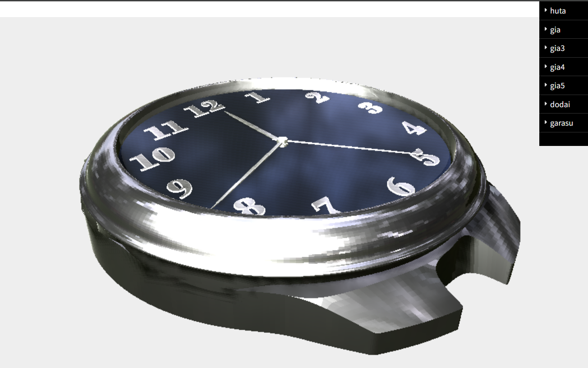
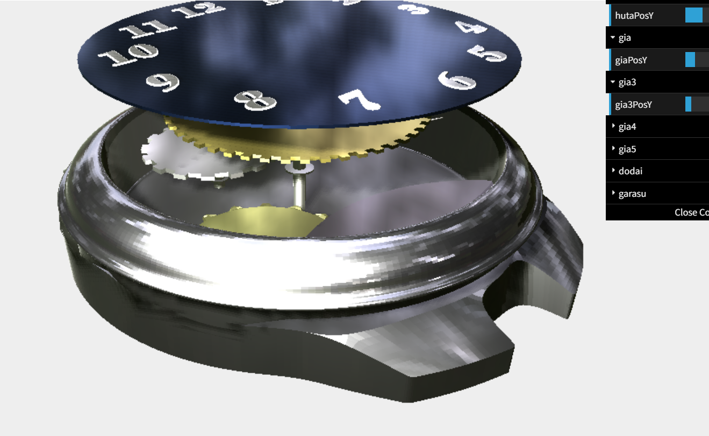
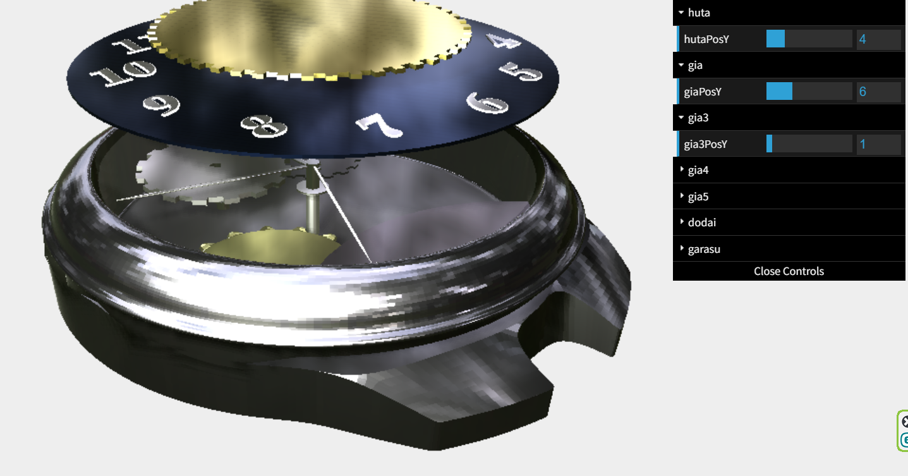

# three_js_clock
Three.js と Blender を用いて制作した3D時計です。
大学の授業課題をベースに、時計の外観だけでなく内部構造も見えるように制作しました。  
金属感のある表現を目指し、EXR環境マップやPBRマテリアルを使用しています。

※ GitHub Pages の容量制限の都合上、一部アセットや環境設定を軽量化しています。  
そのため、以下の参考画像とは一部見た目が異なります。
## Screenshot

## 使用技術
- Three.js
- Blender
- OBJ / MTL Loader
- EXR Environment Map
- dat.GUI

## 工夫した点
- Blenderで作成した複数のパーツをThree.js上で読み込み
- 金属感を出すために環境マップを使用
- dat.GUIで一部パーツの位置を調整可能
- 歯車や針を回転させ、時計内部の動きを表現

